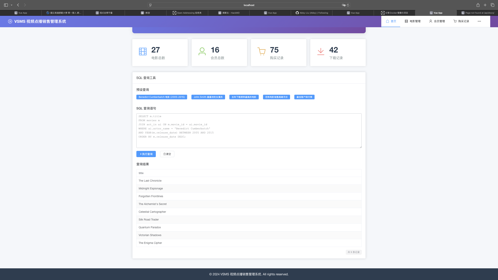
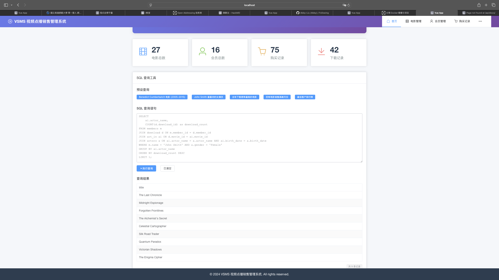
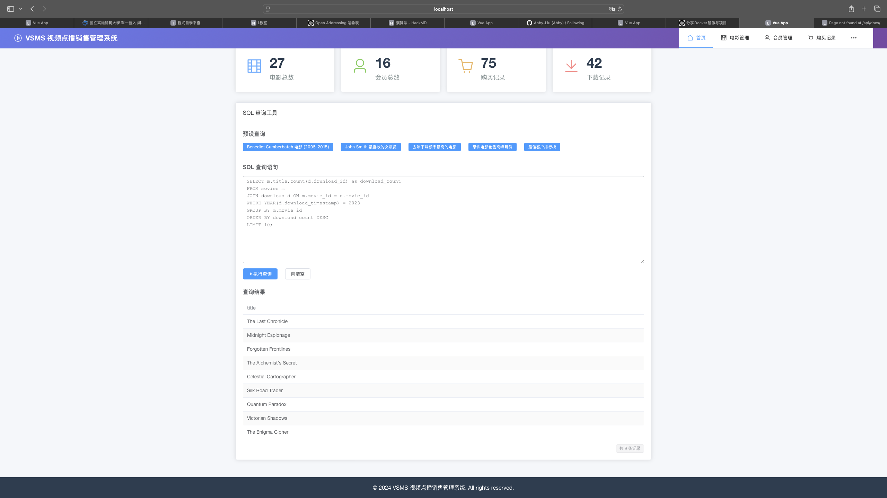
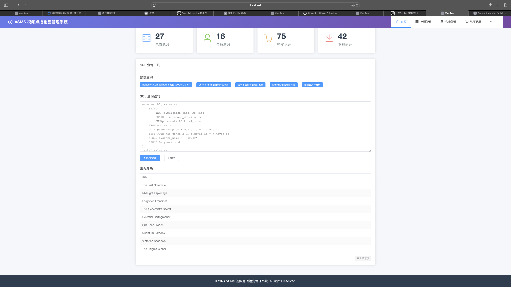
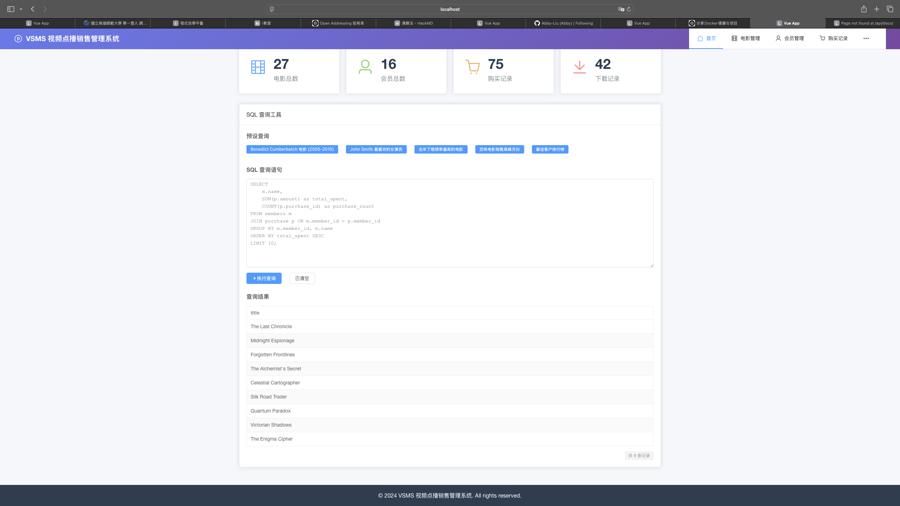

# VSMS - video sales management system
# 411277043趙徊智  411277017 黃榮恩

# 前言
- This is a term project for course 'Database'.
- 基於 Django + Vue.js 的現代化視頻店管理系統。
- 因為每台設備環境不同；建議使用Docker部署。
- 因為Django會自動在資料庫生成一些表；是Django框架的基礎設施表，不是業務邏輯的一部分;auth開頭和django開頭的表，這些表不會畫在er圖和關係模型上。
- *** 記得要先可以連上學校的資料庫（連上學校vpn）後才能正常運行。*** 

---

## 介面展示
- Find the titles of movies stared by “Benedict Cumberbatch” and released between 2005 and 2015.

- Find the favorite actress (es) of the member named “John Smith.” (whose movies are downloaded the most).

- View 10 most frequently downloaded titles for the last year.

- Find the month in which the sales of horror movies gross the most.

- View10 best customers (in terms of money paid to the company)


## ER圖

## 關係模型


## 功能特性
- 電影管理：增刪改查
- 會員管理：會員添加、修改、狀態管理，刪除
- 類型管理：分類和標籤
- 搜尋篩選：多條件查詢
- SQL查詢工具準備好了默認的sql語句（期末專題說明文檔中要求的查詢語句）


## 技術棧
**後端**：Django 4.2 + MySQL 8.0  
**前端**：Vue.js 3 + Element Plus

## 環境要求
- Python 3.8+
- Node.js 16+
- MySQL 8.0+
- 可以連結學校的資料庫的設備 (因為是用學校的資料庫，如果連不上後端就開啟不了)

### 資料庫
目前使用的是NKNU的資料庫，
'NAME': '411277043',
'USER': '411277043',
'PASSWORD': '411277043',
'HOST': '140.127.74.226',
'PORT': '3306'

## 部署說明
本專安有倆種部署方法：
    方法一： Docker部署
        查看DOCKER_README.md文件逕行部署。
    方法二： 本地部署
        繼續查看本文檔逕行部署。

## 快速部署


### 後端設置
```bash
cd backend
python -m venv venv
source venv/bin/activate  # Windows: venv\Scripts\activate
pip install -r ../requirements.txt # Windows: pip install -r ..\requirements.txt
python manage.py migrate
python manage.py runserver
```

### 前端設置
```bash
cd frontend
npm install
npm run serve
```
# 部署完成後每次打開前端和後端的服務都需要cd到backend（cd好後用python manage.py runserver打開服務）和frontend（cd好後用npm run serve用打開服務）的資料夾下。

### 訪問地址
- 前端：http://localhost:8081
- 後端API：http://localhost:8000/api
```

## Docker 部署
詳見 `DOCKER_README.md` 文件

## 項目結構
```
vsms/
├── backend/          # Django 後端  
├── frontend/         # Vue.js 前端  
└── database/         # 資料庫檔案  

```
如果有問題可以找Bernie，是他教我的。。。
也可以聯繫我，zhmmpw@icloud.com
本專案由AI協助完成
